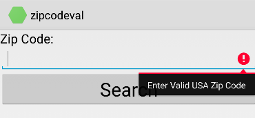

There are a number of ways to validate input depending upon what your user experience requirements are.

###`android:digits` to restrict input:

	<EditText
		android:id="@+id/zipCodeEntry"
		android:layout_width="match_parent"
		android:layout_height="wrap_content"
		android:digits="1234567890-"
	/>

##Validate after entry done and show error message:

    button.Click += delegate { 
	if (!ValidateZipCode(zipCodeEntry.Text))
	{
		zipCodeEntry.Error = "Enter Valid USA Zip Code";
		return;
	}
	DoSubmit();

	protected bool ValidateZipCode(string zipCode)
	{
		string pattern = @"^\d{5}(\-\d{4})?$";
		var regex = new Regex(pattern);
		Log.Debug("V", regex.IsMatch(zipCode).ToString());
		return regex.IsMatch(zipCode);
	}

[![enter image description here][1]][1]

###Implement `View.IOnKeyListener` on your `Activity` and check/validate every key entry

    zipCodeEntry.SetFilters(new IInputFilter[] { this });

	public bool OnKey(View view, [GeneratedEnum] Keycode keyCode, KeyEvent e)
	{
		if (view.Id == Resource.Id.zipCodeEntry)
		{
			Log.Debug("V", keyCode.ToString()); // Validate key by key
		}
		return false;
	}

###Use an `InputFilter` (Implement `IInputFilter` on your activity):

	public ICharSequence FilterFormatted(ICharSequence source, int start, int end, ISpanned dest, int dstart, int dend)
	{
		StringBuilder sb = new StringBuilder();
		for (int i = start; i < end; i++)
		{
			if ((Character.IsDigit(source.CharAt(i)) || source.CharAt(i) == '-'))
				sb.Append(source.CharAt(i));
		}
		return (sb.Length() == (end - start)) ? null : new Java.Lang.String(sb.ToString());
	}

  [1]: http://i.stack.imgur.com/T4PkE.png

