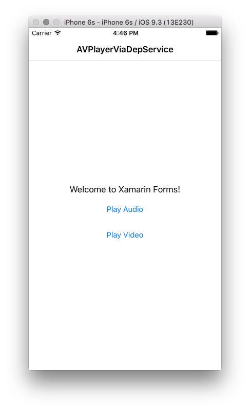

An example of showing a iOS's `AVPlayerViewController` to show an "AVPlayer" via a `Xamarin.Forms` `DependencyService`:

	new Button {
		Text = "Play Audio",
		Command = new Command(() => {
			DependencyService.Get<INativeMediaPlayer>().PlayMediaFile("Audio.mp3");
		})
    },
	new Button {
		Text = "Play Video",
		Command = new Command(() => {
			DependencyService.Get<INativeMediaPlayer>().PlayMediaFile("Video.mp4");
		})
    },

